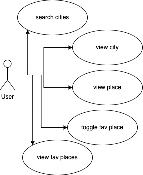
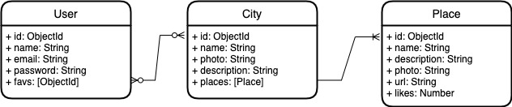

# Wanderlust

This application teaches the user how to search for cities around the world. 
The user will have to register, log in, then you will be taken to the home page where you will have a search engine.
Once the user types the capital of a country, a map with view points will be rendered.
These view points include essential places of each city, historical places, places of contemporary art, places of general culture that includes each capital that you find in this app. 

## Functional Description

the user can register, creating a new account in this app, after creating this account you can log in and enter Wanderlust.

In the App, once we are in HomePage, the user can enter to Menu, where he can log out, change the color of his letters to dark in Home, a Settings button where the user can change his password, and a back button, that button is also useful when you are searching in search and you render the map, you use this back button and you can go back to search to write the city you want to find. 

Once the map is rendered, (used by the Leaflet library) it will open a map with the stable coordinates in the database and the place that the user has chosen.

The rendered map will show, view points (chosen as places, so that the user can click on them and will show an information of the location:
.description
.photo
.more information
.favorites

The user can add to favorites or can go to more information where it will send him to a web page, where he can buy tickets to visit the chosen place.

### Use Cases

User
- search cities
- view city (with places)
- view place
- toggle fav place
- view fav places (list)

## Technical Description

### Blocks

### Data Model

User
- id: ObjectId
- name
- email
- password
- favs: [id]

City
- id: ObjectId
- name
- photo
- description
- places: [Place]

Place
- id: ObjectId
- name
- description
- photo
- url
- likes: number 

