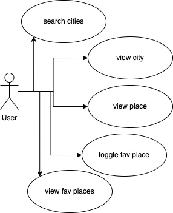
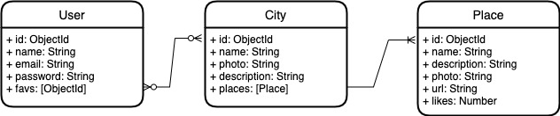

# Wanderlust

blah blah blah

## Functional Description

### Use Cases

User
- search cities
- view city (with places)
- view place
- toggle fav place
- view fav places (list)

## Technical Description

### Blocks

### Data Model

User
- id: ObjectId
- name
- email
- password
- favs: [id]

City
- id: ObjectId
- name
- photo
- description
- places: [Place]

Place
- id: ObjectId
- name
- description
- photo
- url
- likes: number 

