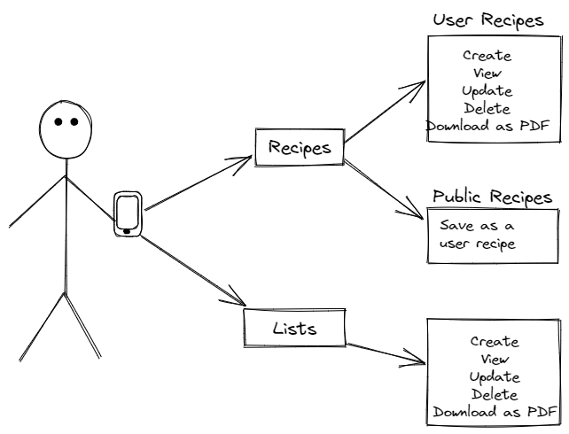
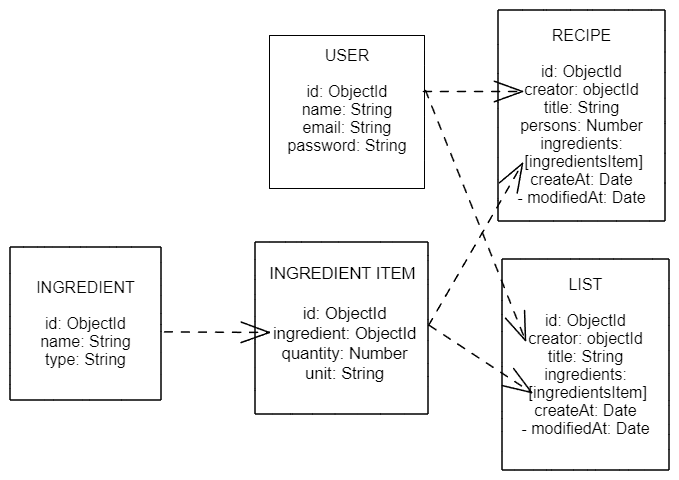

# MENUGER

## Introduction

Menuger is a menu manager (yup) designed to make shopping at the supermarket easier for users, generating a clear shopping list that helps them organize their daily meals.

The application has two potential targets, on the one hand, the person who wants to organize their weekly menu to purchase their favorite recipes, and on the other hand, the large groups that decide to go on a trip and want to manage the purchase easier for their trip.

If you are tired of arriving from the supermarket with bags full of 2x1s and unnecessary food, this is your application!

## Functional Description

- user must be registered for using Menuger
- at the recipes page, user can view her/him recipes, the public recipes from data base, and add a new recipe
- the user recipes, can be viwed, downloaded as a PDF, modified, deleted and the user can create a new one from a reference recipe.
- user can retrieve a public recipe and add to him/her data base
- at the lists page, user can view her/him lists, and add a new lists
- the user lists, can be viwed, downloaded as a PDF, modified, deleted and the user can create a new one from a reference list.
- at profile page, user can update him/her password and email

### Use Cases

User
- register, login, update email and update password
- create, retrieve, update and delete user recipes
- retrieve and save public recipes
- view recipes and download as PDF file
- create, retrieve, update, and delete lists from recipes
- view lists and download as PDF file

## Technical Description

### Blocks

### Flow

TODO

### Data Model

user
- id: ObjectId
- name: String
- email: String
- password: String

ingredient
- id: ObjectId
- String
- type: String

ingredientItem 
- id: ObjectId
- ingredient: ObjectId (ref)
- quantity: Number
- unit: String

recipe
- id: ObjectId
- creator: objectId
- title: String
- persons: Number
- ingredients [ingredientsItem]
- createAt: Date
- modifiedAt: Date

list:
- id: ObjectId
- creator: objectId
- title: String
- ingredients [ingredientsItem]
- createAt: Date
- modifiedAt: Date

### Technologies
- API
    - NodeJS
    - Express
    - MongoDB
    - Libraries:
       - Mongoose
       - Jest
       - Chai
       - Jsonwebtoken
       - Winston
- APP
    - React JS
    - Sass
    - Libraries:
        - react-toastify
        - html2pdf

## Roadmap
### DONE
- ingredients, ingredientsItem, recipes, lists and user schemas
- register, authenticate, retrieve and update user
- create, retrieve, delete, update user recipes
- retrieve and save public recipes
- create, retrieve, delete and update lists
- sass styles
- print to pdf recipes and lists
- feedback with react-toastify

### TODO 
- specs
- encrypt passwords and make a regex validator
- menu funcionality (schema and logics) as previous step to lists 
- ligth theme
- ask for confirmation to update user and delete lists/recipes
- add form to add ingredients
- recipes searcher
- add to favs the public recipes
- clean and unify code
- add how to make a recipe?
- add recipe photo
- add the type of product in the shopping list and the possibility of sorting the items in the list
- recalculate ingredients according to people