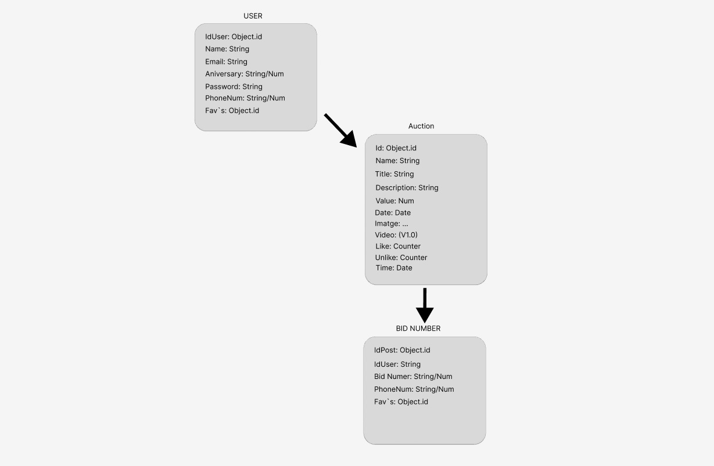

 # Proyect Final ---> Matias Bua.

# Description

This auction application is designed for those little artists who want to start their business, giving you the possibility to publish your creations where they can be made known!
Its mobile design allows you to follow your favorite auctions and be able to bid on them without having to be on a computer, giving you the possibility of following them remotely!
 
 
## Funcional Description

In this application will allow you to connect from anywhere and access the possibilities of creating a generic user for everyone, with which everyone can create publications that are auctions, you can also make them on categories, and bid on those that have generated the interest of users, being able to bid on the product.
our system is adapted to all audiences, but we will have the restriction of a minimum of 18 years to be able to freely have the necessary bank details in their auctions or sales, we also have a profile section that will also have the possibility to notify their interest in some type of article by publishing an offer of interest so that any user can contact its creator.
 
 

## Tecnhical Description
 

- Login

- Register
    - create user

- Home
    - User
        - create auction
        - create bid
        - change profile infomation
        - change password

- Home
    - Home list auction
    - User list auction
    - messages with users

## Use cases

 
User

 - create auction
 - create bid on auction - (check wallet, pay when you win.)
 - view most recent auctions
 - filter (search) auctions
 - view auction (bids list)
 - view notifications (ex: won auction)
 - view bidded auctions
 - view won auctions
 
 
## Flows

## UI Desing

## Technical Description

 - Blocks
 - Sequence
 - Components
 - Code Coverage (Testing)
 - Technologies

## Data Model

User
- id: ObjectId
- name: String
- email: String
- password: String
- phone: number
- birth: Date

Auction
- id: ObjectId
- user: ObjectId
- title: String
- description: String
- image: String
- video: String (optional)
- price: Number
- publishDate: Date
- expirationDate: Date
- bids: [Bid]
- owner: ObjectId (User)

Bid (embedded)
- id: ObjectId
- user: ObjectId
- payment: Payment
- price: Number
- date: Date

## Code Coverage (Logics)
 - TODO (test de covertura al codigo)

## Technologies 

 - Mongoose
 - Test Jest
 - JS React
 - winstone
 - TODO sass

## Roadmap

# V^0
    -DONE Figma
    -DONE Data model & schemas
    -DONE data model to mongoose
    -DONE populate data
    -DONE Figma to react
    -DONE create auction
    -DONE create bid on auction
    -DONE implement user logic
    -DONE implement api routes
    -DONE implement auction logic
    -DONE implement components
    -DONE implement routes
    -DONE navigate app & api
    -DONE test insomnia

    -TODO spec.js           #V1
    -TODO themes(dark, light)       #V1
    -TODO implement responsive app  #V1
    -TODO version desktop           #V1
    -TODO search for category       #V1

# V^1
    -TODO messages system
    -TODO payment with target
    -TODO saveds or favorites
    -TODO cant bid under the current value
    -TODO carrosell in home photos
    -TODO compiled css in sass

# V^1.1

    -TODO ubication geospatial
    -TODO implement auto-bid (bot)
    -TODO sing in History
    -TODO encrypt passwords

